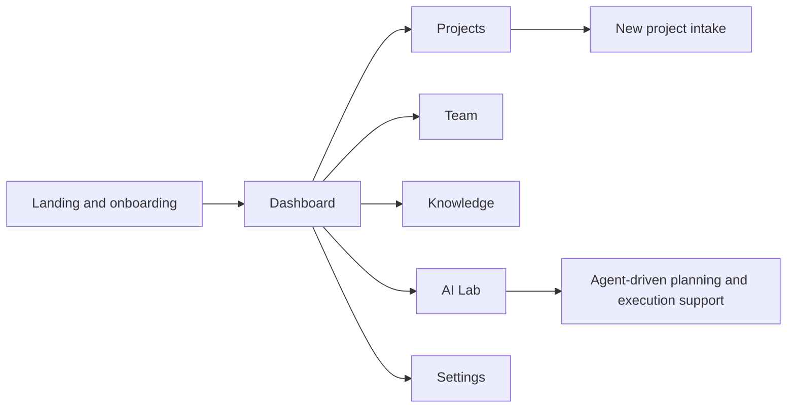
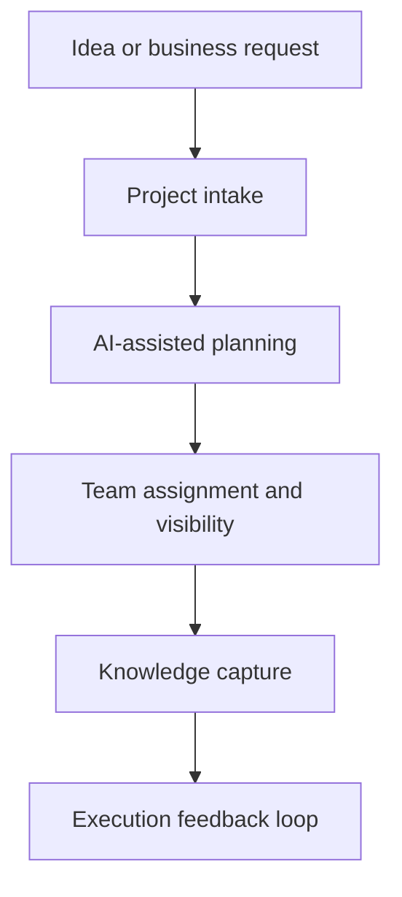
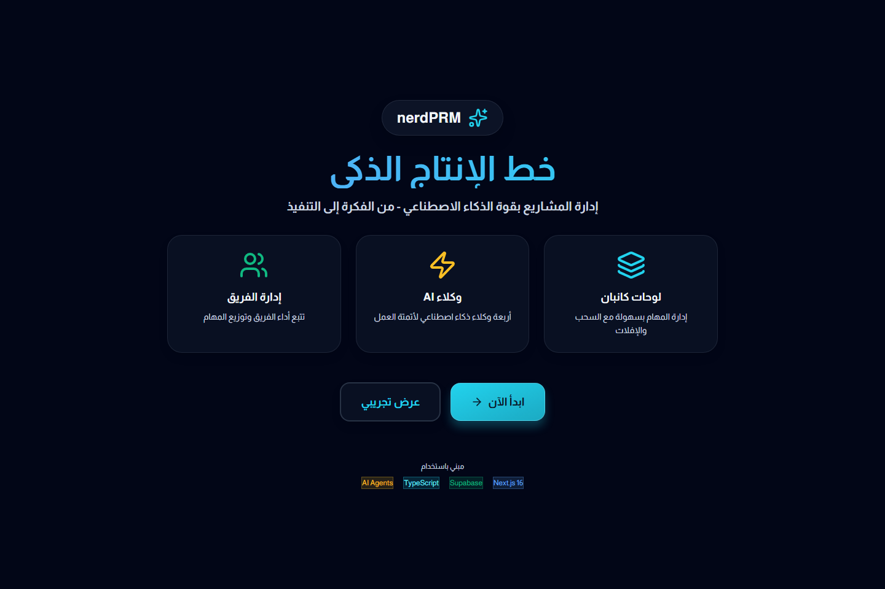

# nerdPRM Showcase

Public-safe product showcase for nerdPRM, an Arabic-first project and resource management direction with AI-assisted planning surfaces.

This repo exists to present the product direction clearly without exposing private integration details, internal credentials, or unstable implementation areas that are still evolving.

## Supporting docs

- [Product direction notes](docs/product-direction.md)
- [Route surface notes](docs/route-surface-notes.md)

## What this showcase covers

- Real landing-page screenshot from a safe local copy
- Product framing for project intake, AI assistance, team visibility, and knowledge workflows
- Route-level module map based on source inspection
- Public explanation of what the product is trying to solve

## Why this product exists

nerdPRM is aimed at the gap between an idea and reliable execution:

- teams collect requirements but lose clarity during delivery
- project intake becomes disconnected from actual planning
- AI features are often bolted on instead of tied to execution workflows
- knowledge and operational context become scattered across tools

## Product direction

nerdPRM is positioned around the gap between an idea and reliable execution:

- project intake and structured kickoff
- AI-assisted planning and agent workflows
- team coordination and work visibility
- knowledge capture around delivery
- Arabic-first interface direction for modern product teams

## Why this public showcase is narrower right now

The public proof is intentionally narrower than the product ambition:

- the strongest safe capture available today is the landing surface
- deeper operational routes exist in the code surface but are better presented later as curated case-study material
- the public layer is meant to communicate the system direction honestly without over-claiming what is ready to publish

## Module map from source inspection

| Surface | Public signal available here |
| --- | --- |
| Landing and onboarding | Real screenshot in this repo |
| Dashboard | Present in route structure |
| Projects and new-project intake | Present in route structure |
| Team | Present in route structure |
| Knowledge | Present in route structure |
| AI Lab | Present in route structure |
| Settings | Present in route structure |

## System map

## Example product journey

## Public evidence

### Real landing surface

The screenshot below was captured from a safe local copy of the frontend.

## What the landing page already proves

- AI assistance is presented as a central product capability, not a decorative label
- Arabic is treated as the native product language rather than a translated afterthought
- the product story connects team management, boards, and agent workflows into one direction

## What still remains private or not yet curated

The current public layer focuses on product shape and interface direction:

- landing surface
- product scope
- route map
- case-study framing

It does not expose:

- private environment values
- production datasets
- internal integrations
- unstable implementation details that should be curated before publication

## What can be added later

Future public-safe additions can include:

- sanitized screenshots for AI Lab and project intake
- deeper architecture notes around agent-assisted planning flows
- a case study on how the product connects ideas, execution, and knowledge capture

## What stands out

- Arabic-first product framing instead of English-first retrofitting
- AI-lab direction integrated into project execution, not tacked on as a gimmick
- clear separation between product narrative and deeper private implementation work

## Related direction

- Main profile: [KareemQabil](https://github.com/KareemQabil)
- Portfolio: [kerimqabil.me](https://kerimqabil.me)
