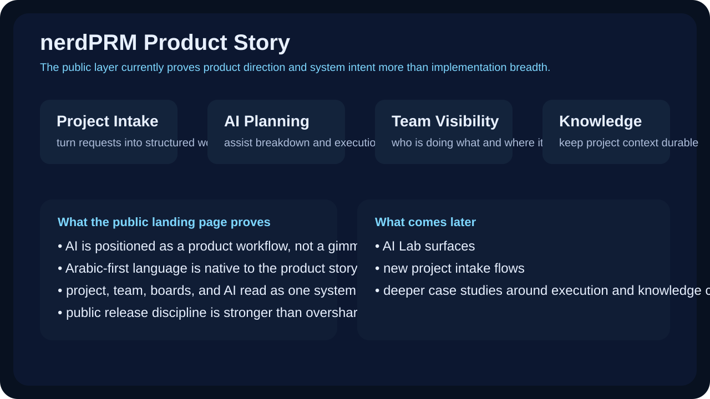
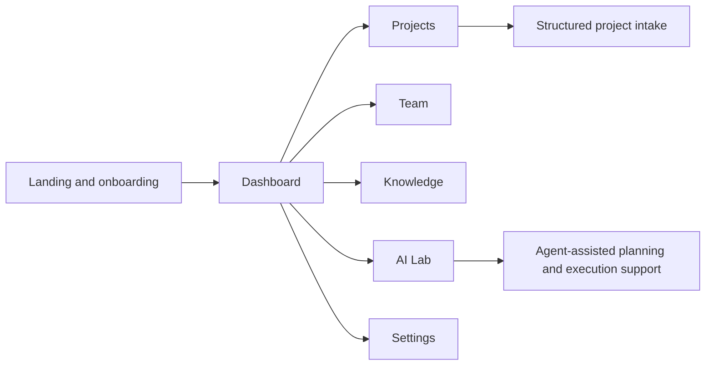

# nerdPRM Showcase

Public-safe case study for nerdPRM, an Arabic-first project and resource management direction with AI-assisted planning surfaces.

This repo is intentionally narrower than the private working direction behind it. The goal is to show the product story clearly and honestly without publishing unstable integrations, credentials, or implementation areas that still need curation before going public.

## Supporting docs

- [Product direction notes](docs/product-direction.md)
- [Route surface notes](docs/route-surface-notes.md)

## What this showcase demonstrates

- landing and onboarding direction from a real local capture
- product framing for project intake, AI assistance, team visibility, and knowledge workflows
- route-level scope for dashboard, projects, team, knowledge, AI Lab, and settings

## What this repo proves publicly

- the product is framed around execution clarity rather than generic task tracking
- AI assistance is treated as a core workflow lane, not a decorative feature
- Arabic-first interface direction is built into the product story from the start

## Product framing

nerdPRM is aimed at a common execution gap:

- ideas and requirements are collected, but delivery clarity is lost
- project intake is disconnected from actual planning work
- AI features are added as gimmicks instead of becoming part of execution
- knowledge and operational context get scattered across tools

## Product map

## Public evidence

<table>
  <tr>
    <td width="100%" valign="top">
      
       
      <strong>Landing and product story</strong>
       
      The current public proof is intentionally focused on the landing surface because it is the cleanest safe capture available right now. It already proves that AI assistance, project work, and Arabic-first interface direction are central to the product narrative.
    </td>
  </tr>
</table>

## What the current public proof already says

- the system is framed around project execution rather than generic task boards
- AI assistance is presented as a core product lane, not a decorative label
- Arabic is treated as a primary interface direction instead of a translated afterthought
- the route surface points to a broader system with projects, team, knowledge, and AI Lab modules

## Route coverage visible from source inspection

| Surface | Public signal today |
| --- | --- |
| Landing and onboarding | Real screenshot in this repo |
| Dashboard | Present in route structure |
| Projects and intake | Present in route structure |
| Team visibility | Present in route structure |
| Knowledge workspace | Present in route structure |
| AI Lab | Present in route structure |
| Settings | Present in route structure |

## Why this repo is narrower than the others

The public layer is intentionally conservative here:

- the strongest safe screenshot today is the landing surface
- deeper operational routes exist in the working codebase, but they need cleaner curation before publication
- the goal is to avoid over-claiming while still making the product direction legible

## Public vs private boundary

Public here:

- landing capture
- route map
- product framing
- case-study narrative

Kept private by design:

- internal integrations
- environment values
- unstable implementation details
- deeper operational flows that are not yet curated for public release

## What can be added later

Future public-safe additions can include:

- sanitized screenshots for AI Lab and project intake
- deeper notes around agent-assisted planning flows
- a case study on connecting ideas, execution, and knowledge capture

## Related direction

- Main profile: [KareemQabil](https://github.com/KareemQabil)
- Portfolio: [kerimqabil.me](https://kerimqabil.me)
