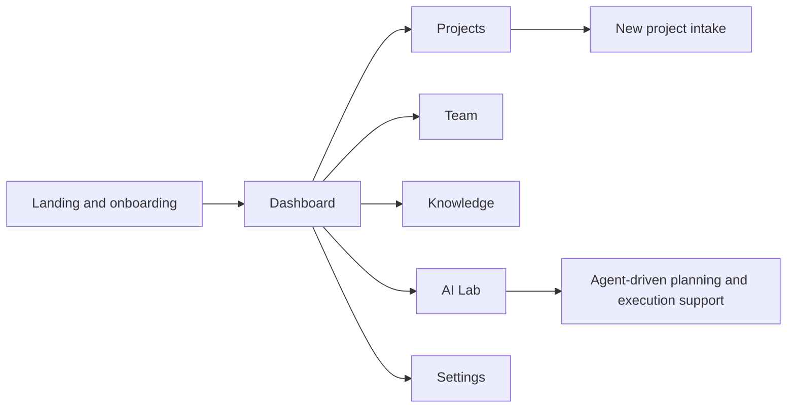

# nerdPRM Showcase

Public-safe product showcase for nerdPRM, an Arabic-first project and resource management direction with AI-assisted planning surfaces.

This repo exists to present the product direction clearly without exposing private integration details, internal credentials, or unstable implementation areas that are still evolving.

## What this showcase covers

- Real landing-page screenshot from a safe local copy
- Product framing for project intake, AI assistance, team visibility, and knowledge workflows
- Route-level module map based on source inspection
- Public explanation of what the product is trying to solve

## Product direction

nerdPRM is positioned around the gap between an idea and reliable execution:

- project intake and structured kickoff
- AI-assisted planning and agent workflows
- team coordination and work visibility
- knowledge capture around delivery
- Arabic-first interface direction for modern product teams

## Module map

## Public evidence

### Real landing surface

The screenshot below was captured from a safe local copy of the frontend.

## Why this repo is public-safe

The current public layer focuses on product shape and interface direction:

- landing surface
- product scope
- route map
- case-study framing

It does not expose:

- private environment values
- production datasets
- internal integrations
- unstable implementation details that should be curated before publication

## What stands out

- Arabic-first product framing instead of English-first retrofitting
- AI-lab direction integrated into project execution, not tacked on as a gimmick
- clear separation between product narrative and deeper private implementation work

## Related direction

- Main profile: [KareemQabil](https://github.com/KareemQabil)
- Portfolio: [kerimqabil.me](https://kerimqabil.me)
